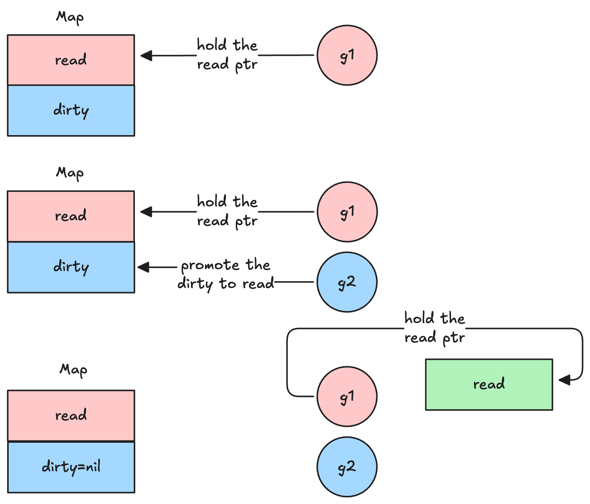
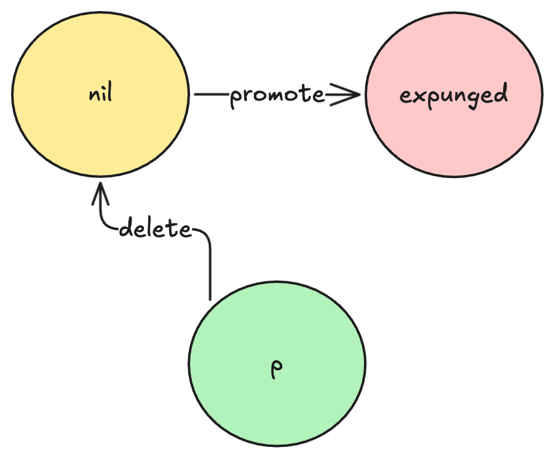

哈希表是日常开发中常用的一种数据机构，用于存储键值对。它的基本原理是通过哈希函数将键映射到一个索引位置，然后在该位置存储对应的值。它可以实现 $O(1)$ 的查找、插入和删除操作。

golang 内置了 `map` 作为哈希表的实现，它基于拉链法解决哈希冲突，并实现了渐进式 rehash 机制来扩容哈希表。然而，map类型不支持并发写，因此 golang 的标准库 sync 提供了 `sync.Map` 类型，用于支持并发写。

近期，golang 使用瑞士表(swiss table)作为其哈希表的实现。本文的目的就是介绍新旧哈希表的区别，以及它们的性能差异。

# 普通map

map的底层如下所示

```go
type hmap struct {
    count     int            // 当前元素个数
    flags     uint8
    B         uint8          // 2^B = bucket 数量
    noverflow uint16         // 溢出桶数量估计值
    hash0     uint32         // 随机哈希种子，防止攻击

    buckets    unsafe.Pointer // 指向 buckets 数组，大小 2^B
    oldbuckets unsafe.Pointer // 扩容时用来保存旧的 bucket
    nevacuate  uintptr        // 迁移进度（扩容时使用）

    extra *mapextra
}

type mapextra struct {
	// overflow 保存了 key&value 的类型都不为指针类型的情况下
	// 哈希桶中溢出桶的指针
	// 
	// 做这个操作的主要原因是，golang 运行时为 key&value 的类型
	// 都不为指针类型的map做了优化，将 buckets 的内存区域标记为
	// 不含指针。那么，bucket 的内存区域就会被 GC 忽略，
	// 从而提高 GC 效率
	// （可以这样考虑，如果bucket被认为是有指针的，GC就会多一轮
	// 扫描 buckets 和 oldbucket 的其他字段的过程，这个过程对于非
	// 指针类型是没有必要的）
	// 
	// 然而，当bucket存满了之后，后续的键值对会被放到溢出桶中
	// 而根据下面 [bmap] 的结构我们可以看到的，bmap中的 overflow
	// 是一个指针。这导致矛盾，即 bucket 被标记为没有指针，
	// 而实际上是有指针的
	// 由于 bucket 的内存区域被忽略，那么溢出桶的
	// 内存区域会被看成是没有被任何对象引用的白色对象，根据gc机制
	// 这块内存会被清理。这就导致了内存不安全
	//
	// 因此，overflow 作为一个兜底策略，用于保存被上述机制所忽略的
	// 溢出桶指针，保证他们被灰色对象引用 
	overflow    *[]*bmap
	oldoverflow *[]*bmap
	
	// 一个性能优化，它预先分配了一个空闲的溢出桶。
	// 当 map 需要一个新的溢出桶时，可以直接从这里获取
	nextOverflow *bmap
}

// NOTE: 实际上 bmap 的实现并不是这样的，bmap目前的实现只
// 有 topbits，其它部分都是直接使用指针运算获得的，因为
// map的key/value类型是不确定的，只能在编译时推导。
// 此处方便理解，标出实际的结构
type bmap struct {
	// 每个 key 的 hash 高 8 位，用来快速定位
    topbits  [8]uint8
    keys     [8]keytype
    values   [8]valuetype
    pad uintptr
    // 溢出桶的指针，同样的，指向一个 bmap
    overflow uintptr
}
```

## 查询

map 中的很多操作都利用了 `tophash`：哈希桶中会为每个key
保存其高八位作为 `tophash`，这样当进行任意操作的时候，
可以利用 `key` 计算 `tophash `
而后遍历哈希桶的 `tophash` 数组(`topbits`) 进行**快速定位**。

查询操作会首先进行**桶定位**，找到hash值对应的桶后，遍历哈希桶及其溢出桶，通过 tophash 快速定位并找到目标key。伪代码如下

> [!NOTE] 
此处伪代码并不代表实际实现

```go
h := hash(key) ^ hash0 // hash value
bucketIndex := h&(2^B-1) // bucket index
bucket := buckets[bucketIndex] // get bucket

// 计算当前哈希值的高8位
func topHash(h uintptr) uint8 { 
	top := uint8(hash >> (goarch.PtrSize * 8 -8)) // get highest 8 bit
	if top < minTopHash{
		top += minTopHash
	}
	return top
}
top := topHash(h)

// 遍历所有桶，通过 tophash 快速定位并找到目标key
for ; bucket != nil; bucket = overflow(){
	for _, tophash := range bucket.topbits{
		if tophash == top{
			if keysEqual(bucket.key[i], key) {
	            return bucket.value[i]
	        }
		}
	} 
}

// 没找到，返回0值
return unsafe.Pointer(&zeroValue[0])
```

## 插入（不考虑扩容）

插入操作类似与查询，在遍历所有 key 的时候，如果找到目标key，则直接覆盖 value 即可。如果没有找到，则需要在第一个空槽位插入新的 key 和 value；如果没有空槽位，则需要创建一个新的溢出桶。

```go
bucket := buckets[bucketIndex] // get bucket
top := tophash(h)
// check if map is growing
if isgrowing() {
	growWork(t, h, bucket)
}
// loop over all bucket(include overflow bucket)
for ; bucket != nil; bucket = bucket.overflow {
	// firstEmpty indicate the first empty slot in the buckets
	firstEmpty := -1
	for i := 0; i < 8; i++{
		th := b.tophash[i]
		if th == top && keysEqual(b.keys[i], key) {
			b.values[i] = val
			return
		}
		if th == empty && firstEmpty == -1 {
			firstEmpty = i
		}
	}
}

// after loop, if find any empty slot
// insert key and value
if firstEmpty != -1 {
	// insert here
	b.keys[firstEmpty] = key
	b.values[firstEmpty] = val
	b.tophash[firstEmpty] = top
	h.count++
	return
}
// no empty slot to be inserted, need a new overflow bucket
newb := allocateOverflowBucket()
newb.keys[0] = key
newb.values[0] = val
newb.tophash[0] = top
linkOverflowBucket(buckets[bIdx], newb)
h.count++

```

## 扩容

扩容有两种情况

- 负载因子大于6.5：这种情况会进行正常扩容
- 存在过多的溢出桶：进行 `sameSizeGrow` 扩容。这是一种特殊情况，我们插入大量元素后删掉大量元素，此时 map 内部会存在大量的空溢出桶，但是之后只要哈希表的元素个数不触发扩容，这些空溢出桶就会一直存在，导致内存泄漏

扩容分为两个步骤，第一是先创建扩容后的哈希桶，第二是将旧桶中的元素逐步迁移到新桶中。

```go
// 检查负载因子是否大于6.5
overload := overLoadFactor(h.count+1,h.B)
// 检查是否存在过多的溢出桶
toomanyOverflowBucket := tooManyOverFlowBuckets(h.noverflow,h.B)

// 为了避免性能突变, 直接将旧桶迁移到新桶不是一个好方法
// 因此 map 实现了渐进式扩容
// h.growing() 返回 map 是否正在进行扩容
if !h.growing() && (overload || toomanyOverflowBucket)) {
	hashGrow(h)
	//...
}
// go map resize's main goal is clearing the overload bucket chain
// 
// because if key cannot be found in the buckets, map will search
// the bucket's overload bucket. 
// in some edge cases, the overload bucket chain maybe very long
// and cause the search operation time complexity from O(1) to O(n)
func hashGrow(h *hmap) {
	// bigger is used to indicate that the buckets should be 
	// double or not
	bigger := 1
	
	// if grow isn't caused by overload
	// this grow will be `sameSizeGrow`
	//
	// `sameSizeGrow` will not double the buckets
	// it create the same number of bucket with h.buckets
	// and rehash the old buckets to new buckets
	if !overload {
		h.flags |= sameSizeGrow
		bigger = 0
	}
	oldbuckets := h.buckets
	newbuckets, nextOverflow := makeBucketArray(t, h.B+bigger, nil)
	
	h.B += bigger
	h.flags = flags
	h.oldbuckets = oldbuckets
	h.buckets = newbuckets
	h.nevacuate = 0
	h.noverflow = 0

	h.extra.oldoverflow = h.extra.overflow
	h.extra.overflow = nil
	h.extra.nextOverflow = nextOverflow
}
```


具体扩容过程如下

- hashGrow 函数仅用于初始化扩容所必需的数据结构
- 扩容的具体逻辑要在初始化之后访问哈希表的时候触发。在扩容期间访问哈希表，会触发迁移过程。所访问key的旧桶（包含bucket和overflow bucket）数据会根据哈希值与旧桶数的与操作结果被迁移到新桶中。
- `nevacuate`记录当前已迁移的旧桶数量，如果`nevacuate==len(oldbuckets)`,那么迁移结束

```go
newbit := noldbucksts()
var xy [2]evacDst
x := &xy[0]
setEvacDst(x)
if !sameSizeGrow {
	y := &xy[1]
	setEvacDst(y)
}

b := buckets[bucketIndex]
for ; b != nil; b = overflow() {
	for i := 0; i < 8; i++ {
		key := getKey(b,i)
		var useY uint8
		if !sameSizeGrow{
			h := hash(key)
			// 计算 h 第 B 位是否为0
			if h&newbit != 0 {
				useY = 1
			}
		}
		dst := xy[useY]
		moveKeyElem(key, getelem(key), dst)
	}
	addEvacuate()
}
```

# Swiss table

瑞士表是来自 Google 的 Sam Benzaquen、Alkis Evlogimenos、Matt Kulukundis 和 Roman Perepelitsa 提出的一种新的 C++ 哈希表设计。golang 1.24 后引入了 Swiss table作为内置 map 类型的实现。瑞士表的核心思想是，**利用 SIMD 硬件，将原先迭代比较的方式，替换为并行比较的方式，来加速哈希查找**。即将

```go
for _, tophash := range bucket.topbits{
	if tophash == top{
		if keysEqual(bucket.key[i], key) {
			return bucket.value[i]
		}
	}
} 
```

这个循环转化为单次的 SIMD 指令。

> [!NOTE] 
golang 实现的瑞士表是魔改版的，为了适配golang map的编程原语。下文介绍的也是golang的具体实现。具体原版实现，请看 https://abseil.io/about/design/swisstables

瑞士表有以下的核心概念。

| 名称               | 含义                                             |
| ---------------- | ---------------------------------------------- |
| **Slot**         | 存放单个 key-value 的槽位。                            |
| **Group**        | 包含 8 个 Slot + 1 个 control word。                |
| **Control Word** | 8 字节，用于记录每个 slot 的状态（空/已删/已用）+ hash 低 7 位（H2）。 |
| **H1**           | hash 的高 57 位，用于定位所在 group。                     |
| **H2**           | hash 的低 7 位，用于在 group 内快速筛选匹配。                 |
| **Table**        | 一个完整的 hash 表，由多个 group 组成。                     |
| **Map**          | 顶层结构，包含一个或多个 Table，用于支持可增量扩容。                  |
| **Directory**    | Table 的数组，用来根据 hash 高位选择具体 Table。              |


当哈希表存放的数据少于一个group的8个slot时，dirptr会直接指向一个 group。此时对哈希表的访问和删除都会走另外的 _small 方法


## 查询操作

查询操作按照以下步骤

1. 通过hash定位 directory index
2. 计算 H1 和 H2, H1 用来构建查找序列，H2用来与控制字进行计算，获得 match 数
3. 根据查找序列遍历 Table，根据 match 数定位到具体的 slot，检查 slot 是否为空。如果为空，则返回 nil。如果已使用，则检查 key 是否相等。如果相等，则返回 value。否则，继续遍历查找序列。

> [!TIP] 
查找序列根据 H1 构建，是遍历 group 的一种序列。基于二次探测+三角数序列，保证每个 group 内的 slot 被遍历到。


```go

//go:linkname runtime_mapaccess2 runtime.mapaccess2
func runtime_mapaccess2(typ *abi.MapType, m *Map, key unsafe.Pointer) (unsafe.Pointer, bool) {
	if race.Enabled && m != nil {
		callerpc := sys.GetCallerPC()
		pc := abi.FuncPCABIInternal(runtime_mapaccess1)
		race.ReadPC(unsafe.Pointer(m), callerpc, pc)
		race.ReadObjectPC(typ.Key, key, callerpc, pc)
	}
	if msan.Enabled && m != nil {
		msan.Read(key, typ.Key.Size_)
	}
	if asan.Enabled && m != nil {
		asan.Read(key, typ.Key.Size_)
	}

	if m == nil || m.Used() == 0 {
		if err := mapKeyError(typ, key); err != nil {
			panic(err) // see issue 23734
		}
		return unsafe.Pointer(&zeroVal[0]), false
	}

	if m.writing != 0 {
		fatal("concurrent map read and map write")
	}

	hash := typ.Hasher(key, m.seed)

	// small table case
	if m.dirLen == 0 {
		_, elem, ok := m.getWithKeySmall(typ, hash, key)
		if !ok {
			return unsafe.Pointer(&zeroVal[0]), false
		}
		return elem, true
	}

	// Select table.
	idx := m.directoryIndex(hash)
	t := m.directoryAt(idx)

	// Probe table.
	seq := makeProbeSeq(h1(hash), t.groups.lengthMask)
	h2Hash := h2(hash)
	for ; ; seq = seq.next() {
		g := t.groups.group(typ, seq.offset)

		match := g.ctrls().matchH2(h2Hash)

		for match != 0 {
			i := match.first()

			slotKey := g.key(typ, i)
			slotKeyOrig := slotKey
			if typ.IndirectKey() {
				slotKey = *((*unsafe.Pointer)(slotKey))
			}
			if typ.Key.Equal(key, slotKey) {
				slotElem := unsafe.Pointer(uintptr(slotKeyOrig) + typ.ElemOff)
				if typ.IndirectElem() {
					slotElem = *((*unsafe.Pointer)(slotElem))
				}
				return slotElem, true
			}
			match = match.removeFirst()
		}

		match = g.ctrls().matchEmpty()
		if match != 0 {
			// Finding an empty slot means we've reached the end of
			// the probe sequence.
			return unsafe.Pointer(&zeroVal[0]), false
		}
	}
}

```
> [!TIP]
这个瑞士表的源代码写的赏心悦目，以至于我觉得直接放源代码上来就能解释算法逻辑了。原先的实现充斥了大量的位运算，指针运算，看的让人头大

## 插入

插入的流程和查询差不多

1. 定位目录索引
2. 计算 H1 和 H2, H1 用来构建查找序列，H2用来与控制字进行计算，获得 match 数
3. 遍历查找序列，根据 match 数定位到具体的 slot，并记录第一个被删除的slot/group信息
4. 如果找到相等的 key ，则进行更新；

5. 如果找到空 slot，说明到达查找序列的末尾，说明 key 不存在，需要进行插入。
6. 如果有被删除的slot，可以利用第一个出现的被删除的slot；否则，则插入空 slot

7. 如果哈希表没有剩余空间了，则需要进行 rehash

## 扩容

瑞士表实现的是Extendible Hashing，它并不会对整个哈希表进行扩容，而只会对部分 Table 进行扩容。扩容有两种情况

1. grow: 当 table 的 group 数小于1024的时候，会重新创建一个更大的table(大小为原来的两倍)，并将旧 table 中的元素迁移到新 table 中。

2. split: 当 table 的 group 数大于等于1024的时候，会将 table 拆分成两个 table，每个 table 只有一半的 group。


## 迭代适配

Go map 的迭代语义非常严格，需要满足：

1. 不重复返回同一个元素；
2. 迭代中新增的元素 可能 被返回；
3. 修改的元素返回最新值；
4. 删除的元素不能被返回；
5. 顺序未定义但要随机化。

如果在迭代过程中，map不发生扩容，那么直接顺序遍历 Directory → Table → Group → Slot 即可。

但是如果发生扩容，
- Iterator 记录当前正在遍历的原 Table 引用；
- 即使 Table 被替换（扩容/拆分），仍沿用旧 Table 的 slot 顺序；
- 每个 key 还需重新在新 Table 中查一次，确认是否已删/已改；
- 对于拆分（b 情况）：
	- 旧 Table 被拆成两个；
	- 旧 Table 遍历完后需跳过下一个目录索引（因为那是第二个拆分出来的表）；
	- 使用 localDepth 计算下一个索引；
- 目录增长时，index 要对应倍增。

整个瑞士表实现里最复杂的就是适配 map 原语的迭代了。首先，运行时有两个函数`mapIterStart`和`mapIterNext`，分别用于初始化迭代器和获取下一个键值对。

# `sync.Map`

`sync.Map` 是 Golang 标准库中实现的一个支持并发读写的哈希表，他大量使用了原子操作来实现无锁并发读写

`sync.Map` 维护两个 map，一个是类型为 `atomic.Pointer[readOnly]` 的原子指针 `read` 快照，这个指针指向一个readOnly 结构；一个是类型为 `map[any]*entry` 的标准map dirty，用于处理新键的插入，更新和删除。当 read miss 的时候，读操作会回退到 dirty 进行上锁查询
```go
type Map struct {
	_ noCopy

	mu Mutex

	// read contains the portion of the map's contents that are safe for
	// concurrent access (with or without mu held).
	//
	// The read field itself is always safe to load, but must only be stored with
	// mu held.
	//
	// Entries stored in read may be updated concurrently without mu, but updating
	// a previously-expunged entry requires that the entry be copied to the dirty
	// map and unexpunged with mu held.
	read atomic.Pointer[readOnly]

	// dirty contains the portion of the map's contents that require mu to be
	// held. To ensure that the dirty map can be promoted to the read map quickly,
	// it also includes all of the non-expunged entries in the read map.
	//
	// Expunged entries are not stored in the dirty map. An expunged entry in the
	// clean map must be unexpunged and added to the dirty map before a new value
	// can be stored to it.
	//
	// If the dirty map is nil, the next write to the map will initialize it by
	// making a shallow copy of the clean map, omitting stale entries.
	dirty map[any]*entry

	// misses counts the number of loads since the read map was last updated that
	// needed to lock mu to determine whether the key was present.
	//
	// Once enough misses have occurred to cover the cost of copying the dirty
	// map, the dirty map will be promoted to the read map (in the unamended
	// state) and the next store to the map will make a new dirty copy.
	misses int
}

// readOnly is an immutable struct stored atomically in the Map.read field.
type readOnly struct {
	m       map[any]*entry
	amended bool // true if the dirty map contains some key not in m.
}


// An entry is a slot in the map corresponding to a particular key.
type entry struct {
	// p points to the interface{} value stored for the entry.
	//
	// If p == nil, the entry has been deleted, and either m.dirty == nil or
	// m.dirty[key] is e.
	//
	// If p == expunged, the entry has been deleted, m.dirty != nil, and the entry
	// is missing from m.dirty.
	//
	// Otherwise, the entry is valid and recorded in m.read.m[key] and, if m.dirty
	// != nil, in m.dirty[key].
	//
	// An entry can be deleted by atomic replacement with nil: when m.dirty is
	// next created, it will atomically replace nil with expunged and leave
	// m.dirty[key] unset.
	//
	// An entry's associated value can be updated by atomic replacement, provided
	// p != expunged. If p == expunged, an entry's associated value can be updated
	// only after first setting m.dirty[key] = e so that lookups using the dirty
	// map find the entry.
	p atomic.Pointer[any]
}


```

所有关于 `sync.Map` 的操作都可以总结为

- 快速路径：首先对 read map进行无锁原子读写
- 慢速路径：如果 read 中不存在 entry，就会尝试加锁，加锁成功后再次尝试读写 read，之后再考虑对 dirty map 进行查询或插入操作


## 查询
```go
// Load returns the value stored in the map for a key, or nil if no
// value is present.
// The ok result indicates whether value was found in the map.
func (m *Map) Load(key any) (value any, ok bool) {
	read := m.loadReadOnly()
	e, ok := read.m[key]
	if !ok && read.amended {
		m.mu.Lock()
		// Avoid reporting a spurious miss if m.dirty got promoted while we were
		// blocked on m.mu. (If further loads of the same key will not miss, it's
		// not worth copying the dirty map for this key.)
		read = m.loadReadOnly()
		e, ok = read.m[key]
		if !ok && read.amended {
			e, ok = m.dirty[key]
			// Regardless of whether the entry was present, record a miss: this key
			// will take the slow path until the dirty map is promoted to the read
			// map.
			m.missLocked()
		}
		m.mu.Unlock()
	}
	if !ok {
		return nil, false
	}
	return e.load()
}
```

这段代码有两个要点

1. 读 `miss` 后，为 `dirty` 上锁后再检查一次 `read`，因为在 `miss` 后，`dirty` 可能会被其他 goroutine `promote` 为 `read` ，可能会有新数据写入。因此需要再次检查 `read` 是否包含该 `key`

2. 再次检查 `read` 之前需要更新 `read` ，因为可能会导致引用了过期的 `read` 的问题

## 删除
```go {18-20}
func (m *Map) LoadAndDelete(key any) (value any, loaded bool) {
	read := m.loadReadOnly()
	e, ok := read.m[key]
	if !ok && read.amended {
		m.mu.Lock()
		read = m.loadReadOnly()
		e, ok = read.m[key]
		if !ok && read.amended {
			e, ok = m.dirty[key]
			delete(m.dirty, key)
			// Regardless of whether the entry was present, record a miss: this key
			// will take the slow path until the dirty map is promoted to the read
			// map.
			m.missLocked()
		}
		m.mu.Unlock()
	}
	if ok {
		return e.delete()
	}
	return nil, false
}
func (e *entry) delete() (value any, ok bool) {
	for {
		p := e.p.Load()
		if p == nil || p == expunged {
			return nil, false
		}
		if e.p.CompareAndSwap(p, nil) {
			return *p, true
		}
	}
}
```

删除操作值得注意的是，会将 `entry` 的指针置为 `nil` ，之后，当 `dirty` 被 `promote` 到 `read` 时，该 `entry` 会被标记为 `expunged`

```go {9-11,18-20}

func (m *Map) dirtyLocked() {
	if m.dirty != nil {
		return
	}

	read := m.loadReadOnly()
	m.dirty = make(map[any]*entry, len(read.m))
	for k, e := range read.m {
		if !e.tryExpungeLocked() {
			m.dirty[k] = e
		}
	}
}

func (e *entry) tryExpungeLocked() (isExpunged bool) {
	p := e.p.Load()
	for p == nil {
		if e.p.CompareAndSwap(nil, expunged) {
			return true
		}
		p = e.p.Load()
	}
	return p == expunged
}
```

给出 `entry` 结构的状态机如下



## 插入
```go {15-19}
func (m *Map) Swap(key, value any) (previous any, loaded bool) {
	read := m.loadReadOnly()
	if e, ok := read.m[key]; ok {
		if v, ok := e.trySwap(&value); ok {
			if v == nil {
				return nil, false
			}
			return *v, true
		}
	}

	m.mu.Lock()
	read = m.loadReadOnly()
	if e, ok := read.m[key]; ok {
		if e.unexpungeLocked() {
			// The entry was previously expunged, which implies that there is a
			// non-nil dirty map and this entry is not in it.
			m.dirty[key] = e
		}
		if v := e.swapLocked(&value); v != nil {
			loaded = true
			previous = *v
		}
	} else if e, ok := m.dirty[key]; ok {
		if v := e.swapLocked(&value); v != nil {
			loaded = true
			previous = *v
		}
	} else {
		if !read.amended {
			// We're adding the first new key to the dirty map.
			// Make sure it is allocated and mark the read-only map as incomplete.
			m.dirtyLocked()
			m.read.Store(&readOnly{m: read.m, amended: true})
		}
		m.dirty[key] = newEntry(value)
	}
	m.mu.Unlock()
	return previous, loaded
}
```

插入操作的要点是

1. 再次检查 `read` 时，如果 `entry` 被标记为删除，则需要将其加回 `dirty`  中。

> [!NOTE]
这是基于我们前面提到的 `entry` 的状态变化，如果有 `entry` 的状态为 `expunged` ，说明 `dirty` 已经 `promote` 过了，并且 `dirty` 没有维护这个`entry` 。此时，如果只更新 `read` ，那么下一次 `promote` 的时候，这条 `entry` 就会丢失，造成不一致。
