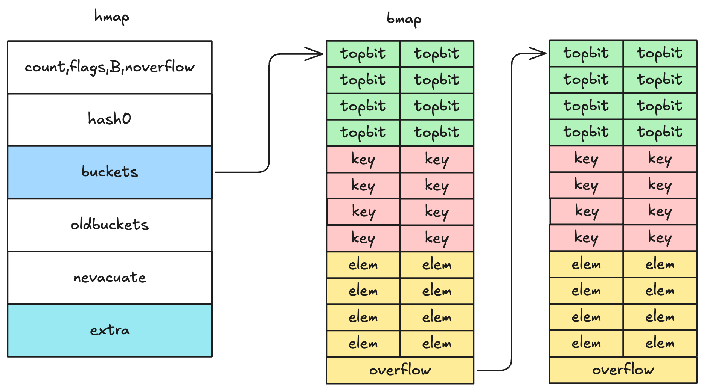
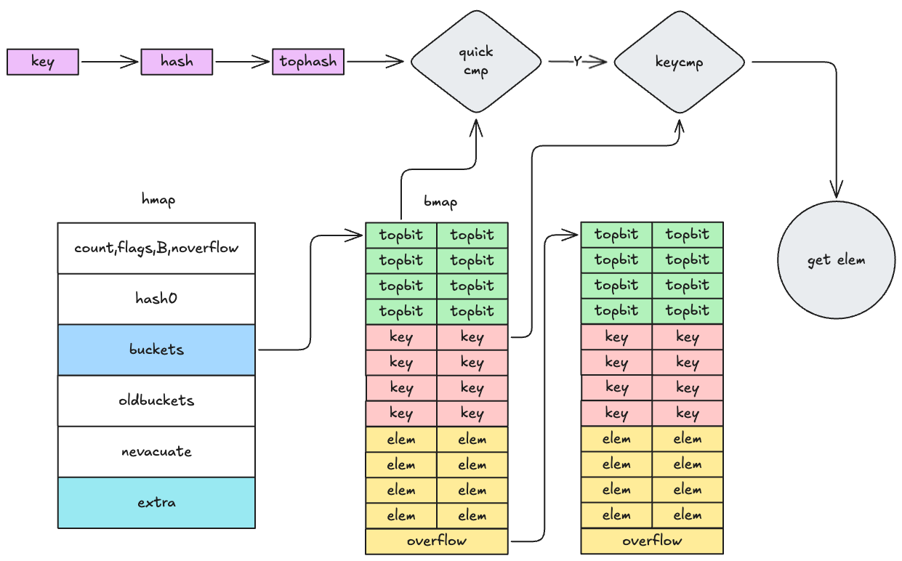
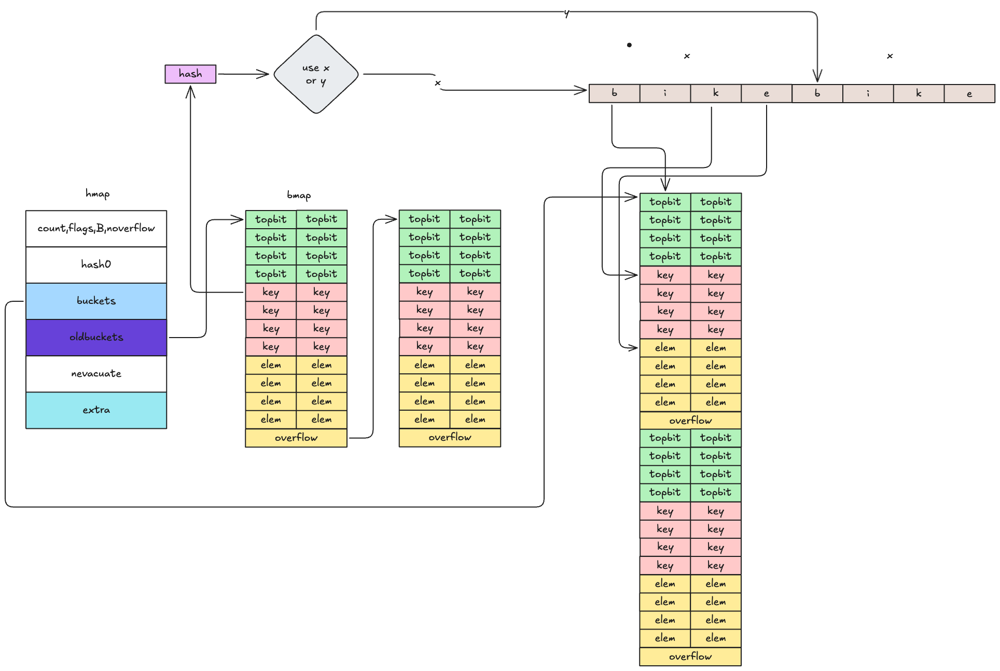
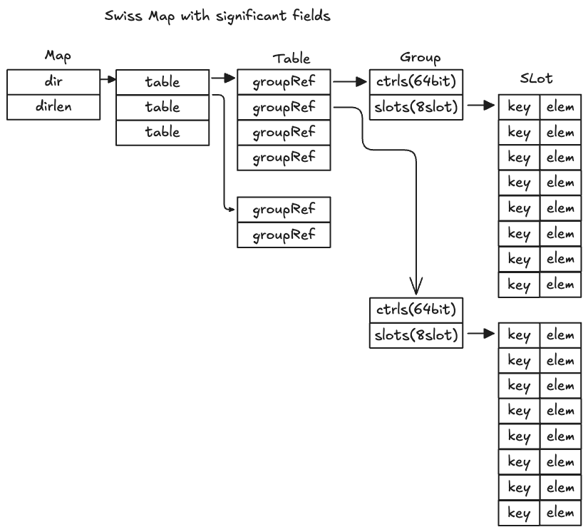
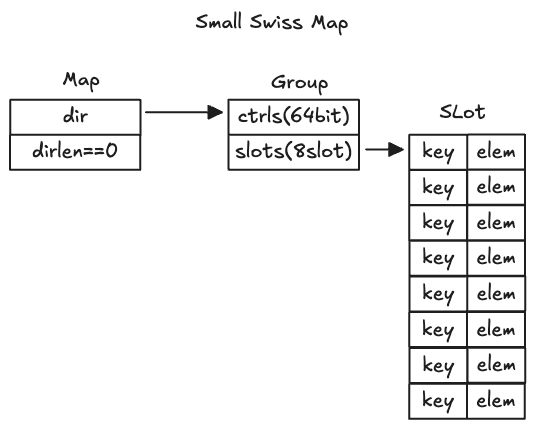
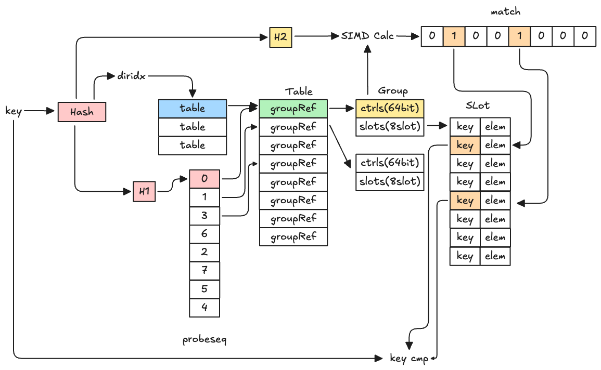
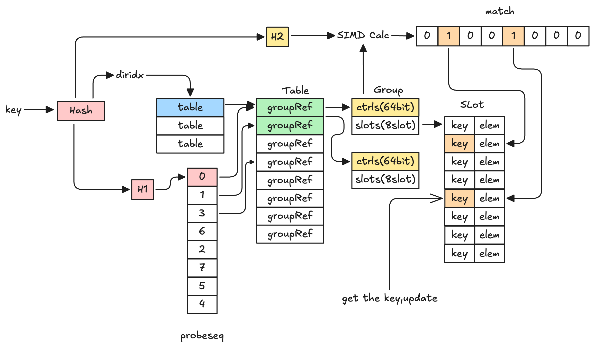
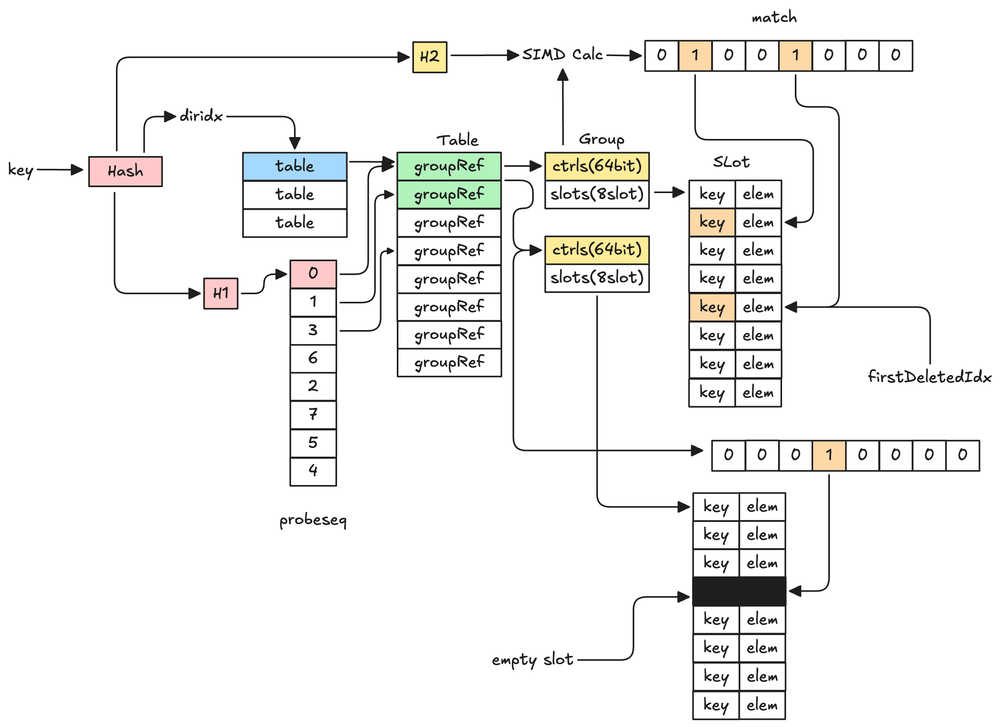
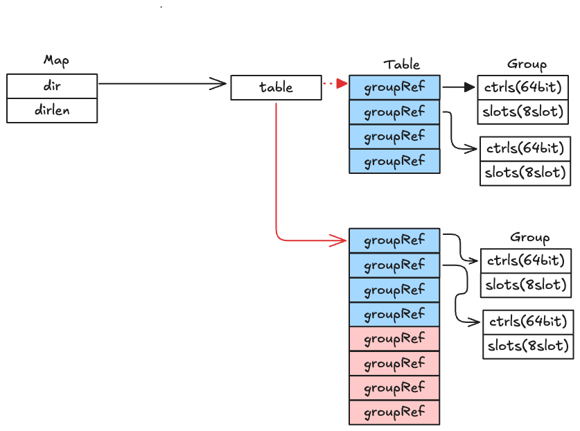
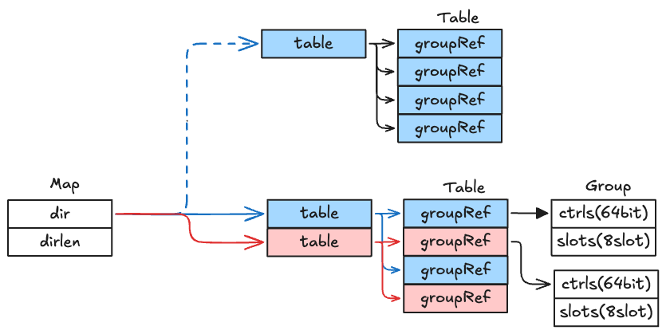

# 前言

哈希表是日常开发中常用的一种数据结构，用于存储键值对。它的基本原理是通过哈希函数将键映射到一个索引位置，然后在该位置存储对应的值。它可以实现 $O(1)$ 的查找、插入和删除操作。

golang 内置了 `map` 作为哈希表的实现，它基于拉链法解决哈希冲突，并实现了渐进式 rehash 机制来扩容哈希表。然而， `map` 类型不支持并发写，因此 golang 的标准库 `sync` 提供了 `sync.Map` 类型，用于支持并发写。

最近，笔者在阅读 golang map 源码的时候，发现其底层实现已经修改为 swiss table，并且，`sync.Map` 的实现也不再依赖于 `map`
 类型，而是实现了哈希树(hashtrietree) 作为其实现。我对这些变化产生了兴趣，也就有了这篇文章。本文将主要介绍 go 原先实现的 `map` 和最新实现的 swiss-table。
# 普通map

首先给出 map 的数据结构并对字段进行解析

```go
type hmap struct {
    count     int            // 当前元素个数
    flags     uint8
    B         uint8          // 2^B = bucket 数量
    noverflow uint16         // 溢出桶数量估计值
    hash0     uint32         // 随机哈希种子，防止攻击

    buckets    unsafe.Pointer // 指向 buckets 数组，大小 2^B
    oldbuckets unsafe.Pointer // 扩容时用来保存旧的 bucket
    nevacuate  uintptr        // 迁移进度（扩容时使用）

    extra *mapextra
}

type mapextra struct {
	// overflow 保存了 key&value 的类型都不为指针类型的情况下
	// 哈希桶中溢出桶的指针
	// 
	// 做这个操作的主要原因是，golang 运行时为 key&value 的类型
	// 都不为指针类型的map做了优化，将 buckets 的内存区域标记为
	// 不含指针。那么，bucket 的内存区域就会被 GC 忽略，
	// 从而提高 GC 效率
	// （可以这样考虑，如果bucket被认为是有指针的，GC就会多一轮
	// 扫描 buckets 和 oldbucket 的其他字段的过程，这个过程对于非
	// 指针类型是没有必要的）
	// 
	// 然而，当bucket存满了之后，后续的键值对会被放到溢出桶中
	// 而根据下面 [bmap] 的结构我们可以看到的，bmap中的 overflow
	// 是一个指针。这导致矛盾，即 bucket 被标记为没有指针，
	// 而实际上是有指针的
	// 由于 bucket 的内存区域被忽略，那么溢出桶的
	// 内存区域会被看成是没有被任何对象引用的白色对象，根据gc机制
	// 这块内存会被清理。这就导致了内存不安全
	//
	// 因此，overflow 作为一个兜底策略，用于保存被上述机制所忽略的
	// 溢出桶指针，保证他们被灰色对象引用 
	overflow    *[]*bmap
	oldoverflow *[]*bmap
	
	// 一个性能优化，它预先分配了一个空闲的溢出桶。
	// 当 map 需要一个新的溢出桶时，可以直接从这里获取
	nextOverflow *bmap
}

// NOTE: 实际上 bmap 的实现并不是这样的，bmap目前的实现只
// 有 topbits，其它部分都是直接使用指针运算获得的，因为
// map的key/value类型是不确定的，只能在编译时推导。
// 此处方便理解，标出实际的结构
type bmap struct {
	// 每个 key 的 hash 高 8 位，用来快速定位
    topbits  [8]uint8
    keys     [8]keytype
    values   [8]valuetype
    pad uintptr
    // 溢出桶的指针，同样的，指向一个 bmap
    overflow uintptr
}
```



## 查询

map 中的很多操作都利用了 `tophash`：哈希桶中会为每个key保存其高八位作为 `tophash`，这样当进行任意操作的时候，可以利用 `key` 计算 `tophash `而后遍历哈希桶的 `tophash` 数组(`topbits`) 进行快速定位。

go map 的查询允许返回一个返回值和两个返回值，两种情况会走不同的运行时方法
```go
v,ok := m[key] ==> mapaccess2()
v := m[key] ==> mapaccess1()
```

两种方法的实现没有太大区别，下面是 `mapaccess1` 的实现

```go {"1":16-26}
func mapaccess1(t *maptype, h *hmap, key unsafe.Pointer) unsafe.Pointer {
	// 一些运行时处理，这里省略
	someRuntimeProcess()
	if h == nil || h.count == 0 {
		if t.hashMightPanic() {
			t.hasher(key, 0) // see issue 23734
		}
		return unsafe.Pointer(&zeroVal[0])
	}
	if h.flags&hashWriting != 0 {
		fatal("concurrent map read and map write")
	}
	hash := t.hasher(key, uintptr(h.hash0))
	m := bucketMask(h.B)
	b := (*bmap)(add(h.buckets, (hash&m)*uintptr(t.bucketsize)))

	if c := h.oldbuckets; c != nil {
		if !h.sameSizeGrow() {
			// There used to be half as many buckets; mask down one more power of two.
			m >>= 1
		}
		oldb := (*bmap)(add(c, (hash&m)*uintptr(t.bucketsize)))
		if !evacuated(oldb) {
			b = oldb
		}
	}
	top := tophash(hash)
bucketloop:
	for ; b != nil; b = b.overflow(t) {
		for i := uintptr(0); i < bucketCnt; i++ {
			if b.tophash[i] != top {
				if b.tophash[i] == emptyRest {
					break bucketloop
				}
				continue
			}
			k := add(unsafe.Pointer(b), dataOffset+i*uintptr(t.keysize))
			if t.indirectkey() {
				k = *((*unsafe.Pointer)(k))
			}
			if t.key.equal(key, k) {
				e := add(
					unsafe.Pointer(b),
					dataOffset+bucketCnt*uintptr(t.keysize)+i*uintptr(t.elemsize),
				)
				if t.indirectelem() {
					e = *((*unsafe.Pointer)(e))
				}
				return e
			}
		}
	}
	return unsafe.Pointer(&zeroVal[0])
}
```

这个代码中最值得注意的就是 bucketloop。bucketloop是 map 操作中广泛使用的概念，首先会通过 hash 得到 bucket，遍历 bucket 以及所有的 overflow bucket。在循环内，通过 tophash 快速定位 key 所在的槽位，并进行相应的计算。

这部分代码还有一个要注意的地方

- 当哈希表正在扩容 `oldbuckets != nil` 时，说明 map 此时正在被扩容，检查 hash 原先所在的 oldbucket 是否已经被迁移。如果未被迁移，那么当前查找需要在旧桶中进行（因为此时新桶内没有数据）



## 写入

对 map 的写入操作会指向运行时中的 `mapassign` 方法：

```go {67-70}
// Like mapaccess, but allocates a slot for the key if it is not present in the map.
func mapassign(t *maptype, h *hmap, key unsafe.Pointer) unsafe.Pointer {
	someRuntimeProcess()
	if h.flags&hashWriting != 0 {
		fatal("concurrent map writes")
	}
	hash := t.hasher(key, uintptr(h.hash0))

	// Set hashWriting after calling t.hasher, since t.hasher may panic,
	// in which case we have not actually done a write.
	h.flags ^= hashWriting

	if h.buckets == nil {
		h.buckets = newobject(t.bucket) // newarray(t.bucket, 1)
	}

again:
	bucket := hash & bucketMask(h.B)
	if h.growing() {
		growWork(t, h, bucket)
	}
	b := (*bmap)(add(h.buckets, bucket*uintptr(t.bucketsize)))
	top := tophash(hash)

	var inserti *uint8
	var insertk unsafe.Pointer
	var elem unsafe.Pointer
bucketloop:
	for {
		for i := uintptr(0); i < bucketCnt; i++ {
			if b.tophash[i] != top {
				if isEmpty(b.tophash[i]) && inserti == nil {
					inserti = &b.tophash[i]
					insertk = add(unsafe.Pointer(b), dataOffset+i*uintptr(t.keysize))
					elem = add(unsafe.Pointer(b), dataOffset+bucketCnt*uintptr(t.keysize)+i*uintptr(t.elemsize))
				}
				if b.tophash[i] == emptyRest {
					break bucketloop
				}
				continue
			}
			k := add(unsafe.Pointer(b), dataOffset+i*uintptr(t.keysize))
			if t.indirectkey() {
				k = *((*unsafe.Pointer)(k))
			}
			if !t.key.equal(key, k) {
				continue
			}
			// already have a mapping for key. Update it.
			if t.needkeyupdate() {
				typedmemmove(t.key, k, key)
			}
			elem = add(unsafe.Pointer(b), dataOffset+bucketCnt*uintptr(t.keysize)+i*uintptr(t.elemsize))
			goto done
		}
		ovf := b.overflow(t)
		if ovf == nil {
			break
		}
		b = ovf
	}

	// Did not find mapping for key. Allocate new cell & add entry.

	// If we hit the max load factor or we have too many overflow buckets,
	// and we're not already in the middle of growing, start growing.
	if !h.growing() && (overLoadFactor(h.count+1, h.B) || tooManyOverflowBuckets(h.noverflow, h.B)) {
		hashGrow(t, h)
		goto again // Growing the table invalidates everything, so try again
	}

	if inserti == nil {
		// The current bucket and all the overflow buckets connected to it are full, allocate a new one.
		newb := h.newoverflow(t, b)
		inserti = &newb.tophash[0]
		insertk = add(unsafe.Pointer(newb), dataOffset)
		elem = add(insertk, bucketCnt*uintptr(t.keysize))
	}

	// store new key/elem at insert position
	if t.indirectkey() {
		kmem := newobject(t.key)
		*(*unsafe.Pointer)(insertk) = kmem
		insertk = kmem
	}
	if t.indirectelem() {
		vmem := newobject(t.elem)
		*(*unsafe.Pointer)(elem) = vmem
	}
	typedmemmove(t.key, insertk, key)
	*inserti = top
	h.count++

done:
	if h.flags&hashWriting == 0 {
		fatal("concurrent map writes")
	}
	h.flags &^= hashWriting
	if t.indirectelem() {
		elem = *((*unsafe.Pointer)(elem))
	}
	return elem
}
```

这个源码比较长，这里将其拆分为几个部分进行解析

- bucketloop 部分：与查询操作类似，不同在于循环过程需要记录 empty slot 的索引
- 检查负载因子和溢出桶数目，决定是否触发扩容。如果触发扩容，则重新进行 bucketloop，找到新的插入位置
- 如果没有找到 empty slot 的索引，说明当前 bucket 以及所有的 overflow bucket 都是满的，需要分配一个新的溢出桶进行插入

写入操作涉及到哈希表的扩容，因此需要对扩容做进一步介绍

## 扩容

扩容有两种情况

- 负载因子大于6.5：这种情况会进行正常扩容，创建一个新的 bucket 数组，其大小是原来的两倍
- 存在过多的溢出桶：进行 `sameSizeGrow` 扩容。这是一种特殊情况，当我们往 map 中插入大量元素后再删掉大量元素，此时 `map` 内部会存在大量的空溢出桶，但是之后只要哈希表的元素个数不触发扩容，这些空溢出桶就会一直存在并被 map 持有，不会被 gc，导致内存泄漏

具体扩容过程如下

1. `hashGrow` 函数用于初始化扩容所必需的数据结构，包括将 `bucket` 数组迁移到 `oldbuckets` 字段，以及创建新的 bucket 数组 `buckets`，大小取决于是否为 `sameSizeGrow`
```go
func hashGrow(t *maptype, h *hmap) {
	// If we've hit the load factor, get bigger.
	// Otherwise, there are too many overflow buckets,
	// so keep the same number of buckets and "grow" laterally.
	bigger := uint8(1)
	if !overLoadFactor(h.count+1, h.B) {
		bigger = 0
		h.flags |= sameSizeGrow
	}
	oldbuckets := h.buckets
	newbuckets, nextOverflow := makeBucketArray(t, h.B+bigger, nil)

	flags := h.flags &^ (iterator | oldIterator)
	if h.flags&iterator != 0 {
		flags |= oldIterator
	}
	// commit the grow (atomic wrt gc)
	h.B += bigger
	h.flags = flags
	h.oldbuckets = oldbuckets
	h.buckets = newbuckets
	h.nevacuate = 0
	h.noverflow = 0

	if h.extra != nil && h.extra.overflow != nil {
		// Promote current overflow buckets to the old generation.
		if h.extra.oldoverflow != nil {
			throw("oldoverflow is not nil")
		}
		h.extra.oldoverflow = h.extra.overflow
		h.extra.overflow = nil
	}
	if nextOverflow != nil {
		if h.extra == nil {
			h.extra = new(mapextra)
		}
		h.extra.nextOverflow = nextOverflow
	}
}
```
2. 扩容的具体逻辑要在初始化之后访问哈希表的时候触发。在扩容期间访问哈希表，会触发迁移过程`growWork`。
```go
func growWork(t *maptype, h *hmap, bucket uintptr) {
	// make sure we evacuate the oldbucket corresponding
	// to the bucket we're about to use
	evacuate(t, h, bucket&h.oldbucketmask())

	// evacuate one more oldbucket to make progress on growing
	if h.growing() {
		evacuate(t, h, h.nevacuate)
	}
}
```

可以看到，`growWork()` 用到了两次 `evacuate`。`evacuate` 是执行扩容的具体函数。第一次调用 `evacuate`，会将当前 bucket 所对应的旧桶进行迁移。第二次调用是在保证哈希表正在扩容的前提下的`h.growing()`，会根据 `nevacuate` 搬迁下一个旧桶，这里是希望即使 `map` 的访问不均匀（比如用户一直访问同一个键），扩容也能持续推进。

`evacuate` 函数如下

```go
// evacDst is an evacuation destination.
type evacDst struct {
	b *bmap          // current destination bucket
	i int            // key/elem index into b
	k unsafe.Pointer // pointer to current key storage
	e unsafe.Pointer // pointer to current elem storage
}
func evacuate(t *maptype, h *hmap, oldbucket uintptr) {
	b := (*bmap)(add(h.oldbuckets, oldbucket*uintptr(t.bucketsize)))
	newbit := h.noldbuckets()
	if !evacuated(b) {
		// xy contains the x and y (low and high) evacuation destinations.
		var xy [2]evacDst
		x := &xy[0]
		x.b = (*bmap)(add(h.buckets, oldbucket*uintptr(t.bucketsize)))
		x.k = add(unsafe.Pointer(x.b), dataOffset)
		x.e = add(x.k, bucketCnt*uintptr(t.keysize))

		if !h.sameSizeGrow() {
			// Only calculate y pointers if we're growing bigger.
			// Otherwise GC can see bad pointers.
			y := &xy[1]
			y.b = (*bmap)(add(h.buckets, (oldbucket+newbit)*uintptr(t.bucketsize)))
			y.k = add(unsafe.Pointer(y.b), dataOffset)
			y.e = add(y.k, bucketCnt*uintptr(t.keysize))
		}

		for ; b != nil; b = b.overflow(t) {
			k := add(unsafe.Pointer(b), dataOffset)
			e := add(k, bucketCnt*uintptr(t.keysize))
			for i := 0; i < bucketCnt; i, k, e = i+1, add(k, uintptr(t.keysize)), add(e, uintptr(t.elemsize)) {
				top := b.tophash[i]
				if isEmpty(top) {
					b.tophash[i] = evacuatedEmpty
					continue
				}
				if top < minTopHash {
					throw("bad map state")
				}
				k2 := k
				if t.indirectkey() {
					k2 = *((*unsafe.Pointer)(k2))
				}
				var useY uint8
				if !h.sameSizeGrow() {
					// Compute hash to make our evacuation decision (whether we need
					// to send this key/elem to bucket x or bucket y).
					hash := t.hasher(k2, uintptr(h.hash0))
					if h.flags&iterator != 0 && !t.reflexivekey() && !t.key.equal(k2, k2) {
						// If key != key (NaNs), then the hash could be (and probably
						// will be) entirely different from the old hash. Moreover,
						// it isn't reproducible. Reproducibility is required in the
						// presence of iterators, as our evacuation decision must
						// match whatever decision the iterator made.
						// Fortunately, we have the freedom to send these keys either
						// way. Also, tophash is meaningless for these kinds of keys.
						// We let the low bit of tophash drive the evacuation decision.
						// We recompute a new random tophash for the next level so
						// these keys will get evenly distributed across all buckets
						// after multiple grows.
						useY = top & 1
						top = tophash(hash)
					} else {
						if hash&newbit != 0 {
							useY = 1
						}
					}
				}

				if evacuatedX+1 != evacuatedY || evacuatedX^1 != evacuatedY {
					throw("bad evacuatedN")
				}

				b.tophash[i] = evacuatedX + useY // evacuatedX + 1 == evacuatedY
				dst := &xy[useY]                 // evacuation destination

				if dst.i == bucketCnt {
					dst.b = h.newoverflow(t, dst.b)
					dst.i = 0
					dst.k = add(unsafe.Pointer(dst.b), dataOffset)
					dst.e = add(dst.k, bucketCnt*uintptr(t.keysize))
				}
				dst.b.tophash[dst.i&(bucketCnt-1)] = top // mask dst.i as an optimization, to avoid a bounds check
				if t.indirectkey() {
					*(*unsafe.Pointer)(dst.k) = k2 // copy pointer
				} else {
					typedmemmove(t.key, dst.k, k) // copy elem
				}
				if t.indirectelem() {
					*(*unsafe.Pointer)(dst.e) = *(*unsafe.Pointer)(e)
				} else {
					typedmemmove(t.elem, dst.e, e)
				}
				dst.i++
				// These updates might push these pointers past the end of the
				// key or elem arrays.  That's ok, as we have the overflow pointer
				// at the end of the bucket to protect against pointing past the
				// end of the bucket.
				dst.k = add(dst.k, uintptr(t.keysize))
				dst.e = add(dst.e, uintptr(t.elemsize))
			}
		}
		// Unlink the overflow buckets & clear key/elem to help GC.
		if h.flags&oldIterator == 0 && t.bucket.ptrdata != 0 {
			b := add(h.oldbuckets, oldbucket*uintptr(t.bucketsize))
			// Preserve b.tophash because the evacuation
			// state is maintained there.
			ptr := add(b, dataOffset)
			n := uintptr(t.bucketsize) - dataOffset
			memclrHasPointers(ptr, n)
		}
	}

	if oldbucket == h.nevacuate {
		advanceEvacuationMark(h, t, newbit)
	}
}
```

`evacuate` 的源码比较复杂，并且包含了许多实现上的细节。这里我们不追究细节，而是将这个函数大致分为几个步骤

- 计算 `evacDst`，这是迁移上下文，用于后续在 bucketloop 中决策数据应该迁移到哪个新桶
- 尽管 `evacuate` 中没有 bucketloop 的 label，但是 `for ; b != nil; b = b.overflow(t)` 依然是一个 bucketloop。在 bucketloop 中，遍历每个 bucket，对每个 key-value，我们计算应该使用哪个 `evacDst` 作为迁移目标，而后进行迁移。
- 标记 `oldbucket` 的内存为可清理 (`memclrHasPointers`)
- 更新 `h.nevacuate` 为下一个待迁移的 bucket



# Swiss table

瑞士表是来自 Google 的 Sam Benzaquen、Alkis Evlogimenos、Matt Kulukundis 和 Roman Perepelitsa 提出的一种新的 C++ 哈希表设计。golang 1.24 后引入了 Swiss table作为内置 map 类型的实现。瑞士表的核心思想是，**利用 SIMD 硬件，将原先迭代比较的方式，替换为并行比较的方式，来加速哈希查找**。

> [!NOTE] 
golang 实现的瑞士表是魔改版的，为了适配golang `map` 的编程原语。下文介绍的也是golang的具体实现。具体原版实现，请看 https://abseil.io/about/design/swisstables

瑞士表有以下的核心概念。

| 名称               | 含义                                             |
| ---------------- | ---------------------------------------------- |
| **Slot**         | 存放单个 key-value 的槽位。                            |
| **Group**        | 包含 8 个 Slot + 1 个 control word。                |
| **Control Word** | 8 字节，用于记录每个 slot 的状态（空/已删/已用）+ hash 低 7 位（H2）。 |
| **H1**           | hash 的高 57 位，用于定位所在 group。                     |
| **H2**           | hash 的低 7 位，用于在 group 内快速筛选匹配。                 |
| **Table**        | 一个完整的 hash 表，由多个 group 组成。                     |
| **Map**          | 顶层结构，包含一个或多个 Table，用于支持可增量扩容。                  |
| **Directory**    | Table 的数组，用来根据 hash 高位选择具体 Table。              |



当哈希表存放的数据少于一个 `group` 的8个 `slot` 时，`dirptr` 会直接指向一个 `group` 。



## 查询操作

查询操作按照以下步骤

1. 通过hash定位 `directory index`
2. 计算 `H1` 和 `H2`, `H1` 用来构建查找序列，`H2` 用来与控制字进行计算，获得 `match` 数
3. 根据查找序列遍历 Table，根据 `match` 数定位到具体的 slot，检查 slot 是否为空。如果为空，则返回 `nil` 。如果已使用，则检查 key 是否相等。如果相等，则返回 value。否则，继续遍历查找序列。

> [!TIP] 
查找序列根据 `H1` 构建，是遍历 group 的一种序列。基于二次探测+三角数序列，保证每个 group 内的 slot 被遍历到。



```go

//go:linkname runtime_mapaccess2 runtime.mapaccess2
func runtime_mapaccess2(typ *abi.MapType, m *Map, key unsafe.Pointer) (unsafe.Pointer, bool) {
	// ...

	if m == nil || m.Used() == 0 {
		if err := mapKeyError(typ, key); err != nil {
			panic(err) // see issue 23734
		}
		return unsafe.Pointer(&zeroVal[0]), false
	}

	if m.writing != 0 {
		fatal("concurrent map read and map write")
	}

	hash := typ.Hasher(key, m.seed)

	// small table case
	if m.dirLen == 0 {
		_, elem, ok := m.getWithKeySmall(typ, hash, key)
		if !ok {
			return unsafe.Pointer(&zeroVal[0]), false
		}
		return elem, true
	}

	// Select table.
	idx := m.directoryIndex(hash)
	t := m.directoryAt(idx)

	// Probe table.
	seq := makeProbeSeq(h1(hash), t.groups.lengthMask)
	h2Hash := h2(hash)
	for ; ; seq = seq.next() {
		g := t.groups.group(typ, seq.offset)

		match := g.ctrls().matchH2(h2Hash)

		for match != 0 {
			i := match.first()

			slotKey := g.key(typ, i)
			slotKeyOrig := slotKey
			if typ.IndirectKey() {
				slotKey = *((*unsafe.Pointer)(slotKey))
			}
			if typ.Key.Equal(key, slotKey) {
				slotElem := unsafe.Pointer(uintptr(slotKeyOrig) + typ.ElemOff)
				if typ.IndirectElem() {
					slotElem = *((*unsafe.Pointer)(slotElem))
				}
				return slotElem, true
			}
			match = match.removeFirst()
		}

		match = g.ctrls().matchEmpty()
		if match != 0 {
			// Finding an empty slot means we've reached the end of
			// the probe sequence.
			return unsafe.Pointer(&zeroVal[0]), false
		}
	}
}

```
> [!TIP]
这个瑞士表的源代码写的赏心悦目，以至于我觉得直接放源代码上来就能解释算法逻辑了。

## 插入

插入的流程和查询差不多

1. 定位目录索引
2. 计算 `H1` 和 `H2`, `H1` 用来构建查找序列，`H2` 用来与控制字进行计算，获得 `match` 数
3. 遍历查找序列，根据 `match` 数定位到具体的 slot，并记录第一个被删除的slot/group信息
4. 如果找到相等的 key ，则进行更新；

5. 如果找到空 slot，说明到达查找序列的末尾，说明 key 不存在，需要进行插入。
6. 如果有被删除的slot，可以利用第一个出现的被删除的slot；否则，则插入空 slot

7. 如果哈希表没有剩余空间了，则需要进行 `rehash`

## 扩容

瑞士表实现的是Extendible Hashing，它并不会对整个哈希表进行扩容，而只会对部分 Table 进行扩容。扩容有两种情况

1. grow: 当 table 的 group 数小于1024的时候，会重新创建一个更大的table(大小为原来的两倍)，并将旧 table 中的元素迁移到新 table 中。

2. split: 当 table 的 group 数大于等于1024的时候，会将 table 拆分成两个 table，每个 table 只有一半的 group。


## 迭代适配

Go map 的迭代语义非常严格，需要满足：

1. 不重复返回同一个元素；
2. 迭代中新增的元素 可能 被返回；
3. 修改的元素返回最新值；
4. 删除的元素不能被返回；
5. 顺序未定义但要随机化。

如果在迭代过程中，map不发生扩容，那么直接顺序遍历 Directory → Table → Group → Slot 即可。

但是如果发生扩容，
- Iterator 记录当前正在遍历的原 Table 引用；
- 即使 Table 被替换（扩容/拆分），仍沿用旧 Table 的 slot 顺序；
- 每个 key 还需重新在新 Table 中查一次，确认是否已删/已改；
- 对于拆分（b 情况）：
	- 旧 Table 被拆成两个；
	- 旧 Table 遍历完后需跳过下一个目录索引（因为那是第二个拆分出来的表）；
	- 使用 localDepth 计算下一个索引；
- 目录增长时，index 要对应倍增。

> [!IMPORTANT]
Iter 源码解析
