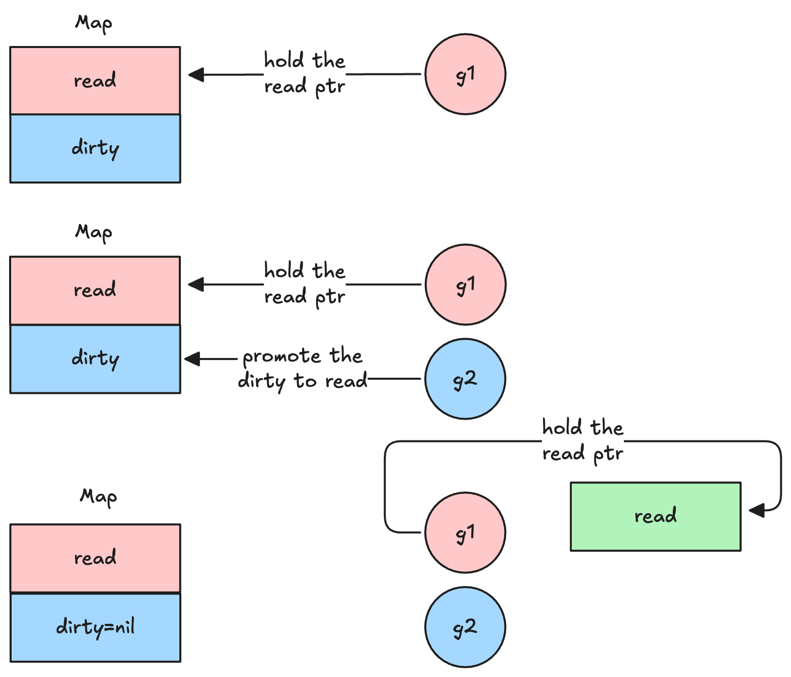
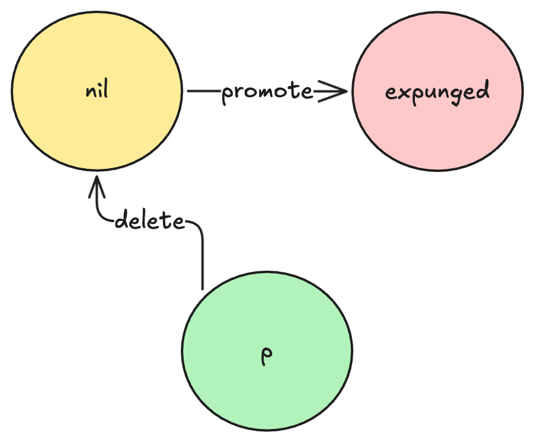

# `sync.Map`

`sync.Map` 是 Golang 标准库中实现的一个支持并发读写的哈希表，他大量使用了原子操作来实现无锁并发读写

`sync.Map` 维护两个 map，一个是类型为 `atomic.Pointer[readOnly]` 的原子指针 `read` 快照，这个指针指向一个 `readOnly` 结构，通过原子操作保证并发安全；一个是类型为 `map[any]*entry` 的 `dirty`，用于处理新键的插入，更新和删除。当 read miss 的时候，读操作会回退到 dirty 进行上锁查询
```go
type Map struct {
	_ noCopy

	mu Mutex

	// read contains the portion of the map's contents that are safe for
	// concurrent access (with or without mu held).
	//
	// The read field itself is always safe to load, but must only be stored with
	// mu held.
	//
	// Entries stored in read may be updated concurrently without mu, but updating
	// a previously-expunged entry requires that the entry be copied to the dirty
	// map and unexpunged with mu held.
	read atomic.Pointer[readOnly]

	// dirty contains the portion of the map's contents that require mu to be
	// held. To ensure that the dirty map can be promoted to the read map quickly,
	// it also includes all of the non-expunged entries in the read map.
	//
	// Expunged entries are not stored in the dirty map. An expunged entry in the
	// clean map must be unexpunged and added to the dirty map before a new value
	// can be stored to it.
	//
	// If the dirty map is nil, the next write to the map will initialize it by
	// making a shallow copy of the clean map, omitting stale entries.
	dirty map[any]*entry

	// misses counts the number of loads since the read map was last updated that
	// needed to lock mu to determine whether the key was present.
	//
	// Once enough misses have occurred to cover the cost of copying the dirty
	// map, the dirty map will be promoted to the read map (in the unamended
	// state) and the next store to the map will make a new dirty copy.
	misses int
}

// readOnly is an immutable struct stored atomically in the Map.read field.
type readOnly struct {
	m       map[any]*entry
	amended bool // true if the dirty map contains some key not in m.
}


// An entry is a slot in the map corresponding to a particular key.
type entry struct {
	// p points to the interface{} value stored for the entry.
	//
	// If p == nil, the entry has been deleted, and either m.dirty == nil or
	// m.dirty[key] is e.
	//
	// If p == expunged, the entry has been deleted, m.dirty != nil, and the entry
	// is missing from m.dirty.
	//
	// Otherwise, the entry is valid and recorded in m.read.m[key] and, if m.dirty
	// != nil, in m.dirty[key].
	//
	// An entry can be deleted by atomic replacement with nil: when m.dirty is
	// next created, it will atomically replace nil with expunged and leave
	// m.dirty[key] unset.
	//
	// An entry's associated value can be updated by atomic replacement, provided
	// p != expunged. If p == expunged, an entry's associated value can be updated
	// only after first setting m.dirty[key] = e so that lookups using the dirty
	// map find the entry.
	p atomic.Pointer[any]
}


```

所有关于 `sync.Map` 的操作都可以总结为

- 快速路径：首先对 `read` 进行无锁原子读写
- 慢速路径：如果 `read` 中不存在 `entry` ，就会尝试加锁，加锁成功后再次尝试读写 `read` ，之后再考虑对 `dirty` 进行查询或插入操作
- promote: `read` miss 时将 `misses` 计数加一，当 `misses` 数大于 `dirty` 大小时，会将 `dirty`  promote 为 `read` ，并将 `dirty` 清空


## 查询
```go
// Load returns the value stored in the map for a key, or nil if no
// value is present.
// The ok result indicates whether value was found in the map.
func (m *Map) Load(key any) (value any, ok bool) {
	read := m.loadReadOnly()
	e, ok := read.m[key]
	if !ok && read.amended {
		m.mu.Lock()
		// Avoid reporting a spurious miss if m.dirty got promoted while we were
		// blocked on m.mu. (If further loads of the same key will not miss, it's
		// not worth copying the dirty map for this key.)
		read = m.loadReadOnly()
		e, ok = read.m[key]
		if !ok && read.amended {
			e, ok = m.dirty[key]
			// Regardless of whether the entry was present, record a miss: this key
			// will take the slow path until the dirty map is promoted to the read
			// map.
			m.missLocked()
		}
		m.mu.Unlock()
	}
	if !ok {
		return nil, false
	}
	return e.load()
}
```

这段代码有两个要点

1. 读 `miss` 后，为 `dirty` 上锁后再检查一次 `read`，因为在 `miss` 后，`dirty` 可能会被其他 goroutine `promote` 为 `read` ，可能会有新数据写入。因此需要再次检查 `read` 是否包含该 `key`

2. 再次检查 `read` 之前需要更新 `read` ，因为可能会导致引用了过期的 `read` 的问题

## 删除
```go {18-20}
func (m *Map) LoadAndDelete(key any) (value any, loaded bool) {
	read := m.loadReadOnly()
	e, ok := read.m[key]
	if !ok && read.amended {
		m.mu.Lock()
		read = m.loadReadOnly()
		e, ok = read.m[key]
		if !ok && read.amended {
			e, ok = m.dirty[key]
			delete(m.dirty, key)
			// Regardless of whether the entry was present, record a miss: this key
			// will take the slow path until the dirty map is promoted to the read
			// map.
			m.missLocked()
		}
		m.mu.Unlock()
	}
	if ok {
		return e.delete()
	}
	return nil, false
}
func (e *entry) delete() (value any, ok bool) {
	for {
		p := e.p.Load()
		if p == nil || p == expunged {
			return nil, false
		}
		if e.p.CompareAndSwap(p, nil) {
			return *p, true
		}
	}
}
```

删除操作值得注意的是，会将 `entry` 的指针置为 `nil` ，之后，当 `dirty` 被 `promote` 到 `read` 时，该 `entry` 会被标记为 `expunged`

```go {9-11,18-20}

func (m *Map) dirtyLocked() {
	if m.dirty != nil {
		return
	}

	read := m.loadReadOnly()
	m.dirty = make(map[any]*entry, len(read.m))
	for k, e := range read.m {
		if !e.tryExpungeLocked() {
			m.dirty[k] = e
		}
	}
}

func (e *entry) tryExpungeLocked() (isExpunged bool) {
	p := e.p.Load()
	for p == nil {
		if e.p.CompareAndSwap(nil, expunged) {
			return true
		}
		p = e.p.Load()
	}
	return p == expunged
}
```

给出 `entry` 结构的状态机如下



## 插入
```go {15-19}
func (m *Map) Swap(key, value any) (previous any, loaded bool) {
	read := m.loadReadOnly()
	if e, ok := read.m[key]; ok {
		if v, ok := e.trySwap(&value); ok {
			if v == nil {
				return nil, false
			}
			return *v, true
		}
	}

	m.mu.Lock()
	read = m.loadReadOnly()
	if e, ok := read.m[key]; ok {
		if e.unexpungeLocked() {
			// The entry was previously expunged, which implies that there is a
			// non-nil dirty map and this entry is not in it.
			m.dirty[key] = e
		}
		if v := e.swapLocked(&value); v != nil {
			loaded = true
			previous = *v
		}
	} else if e, ok := m.dirty[key]; ok {
		if v := e.swapLocked(&value); v != nil {
			loaded = true
			previous = *v
		}
	} else {
		if !read.amended {
			// We're adding the first new key to the dirty map.
			// Make sure it is allocated and mark the read-only map as incomplete.
			m.dirtyLocked()
			m.read.Store(&readOnly{m: read.m, amended: true})
		}
		m.dirty[key] = newEntry(value)
	}
	m.mu.Unlock()
	return previous, loaded
}
```

插入操作的要点是

1. 再次检查 `read` 时，如果 `entry` 被标记为删除，则需要将其加回 `dirty`  中。

> [!NOTE]
这是基于我们前面提到的 `entry` 的状态变化，如果有 `entry` 的状态为 `expunged` ，说明 `dirty` 已经 promote 过了，并且 `dirty` 没有维护这个`entry` 。此时，如果只更新 `read` ，那么下一次 promote 的时候，这条 `entry` 就会丢失，造成不一致。
